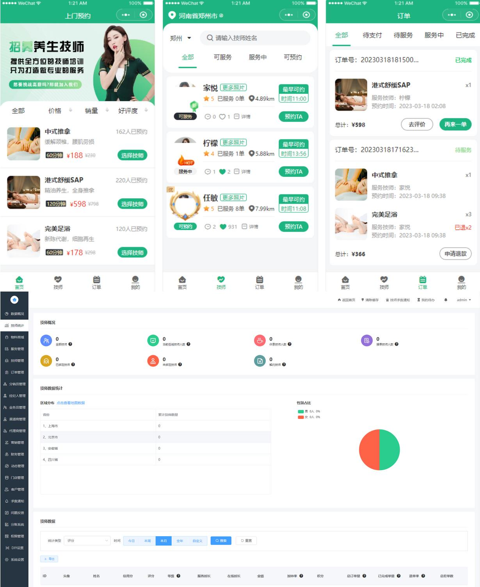
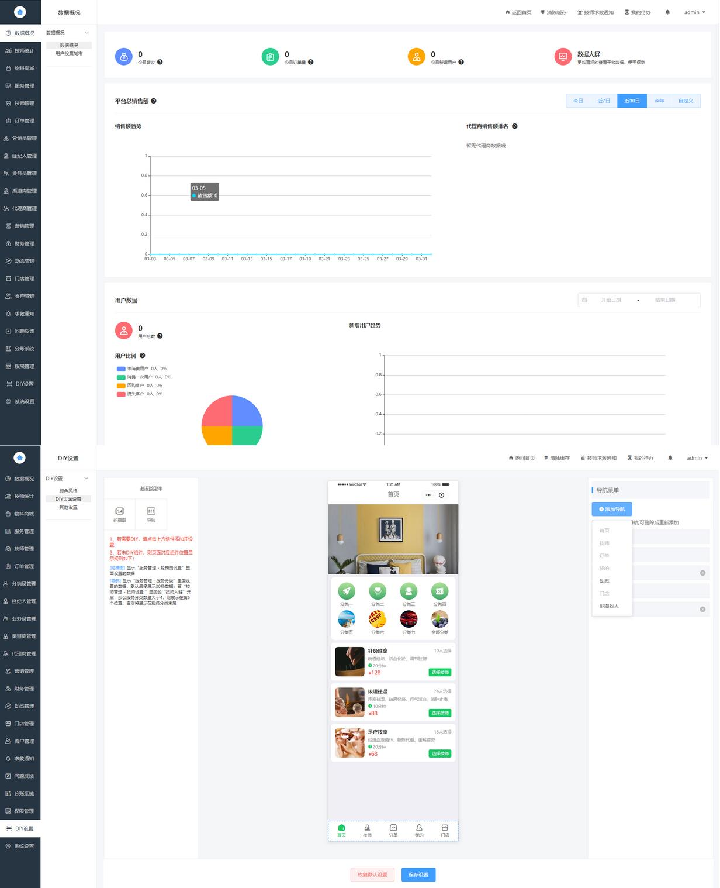
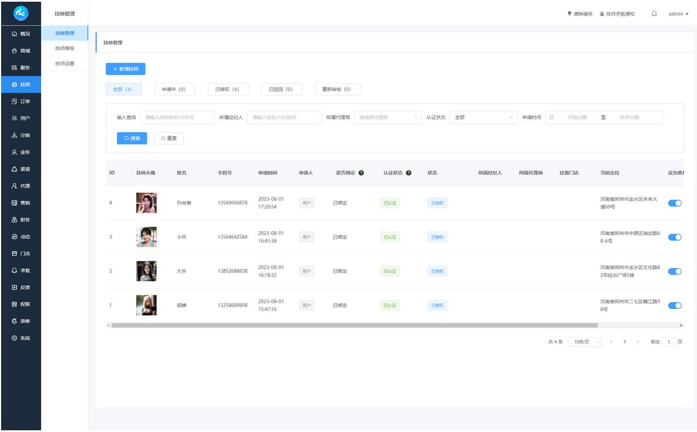

# 上门服务仿东郊到家

#### 获取源码
 
 
 

技术支持或者定制开发请联系v:qq2facai

 

#### 介绍
仿东郊到家源码，仿东郊到家源码-最新，仿东郊到家上门服务源码，陪玩源码，康悦到家，上门按摩，按摩源码，洗浴源码，上门服务源码，到家服务源码，上门美甲源码
 
全新同城上门家政按摩H5小程序源码发布

后端采用ThinkPHP框架，前端基于uni-app开发，完美适配小程序、公众号H5及APP。此套源码为独家购买、全开源版本，无需任何授权，即可快速搭建上门预约系统。

功能亮点：

数据可视化：新增业务城市用户投票与可视化数据大盘，直观展示业务关注度、人气、影响力及各项经营数据。
灵活的服务管理：支持物料费多种计算方式，技师提成后再扣除物料费，满足多样化需求。
个性化设置：平台可为特定技师单独设置固定比例，代理商设置需平台审核，确保业务灵活性。
全面的渠道管理：各渠道商可设不同返佣比例，实现精准激励。
用户体验优化：手机端订单详情增加服务倒计时，提升用户感知。
多行业支持：修改服务业文字后，系统可轻松支持美甲师、上门维修等多行业。
创新的业务模式：新增技师经纪人角色，用户邀请技师可获得佣金，激发用户参与度。
完善的会员体系：新增会员等级、权益及设置，提升用户粘性，促进业绩增长。
强大的分账系统：支持对私、对公分账，满足不同业务需求。
高度自定义：DIY页面设置，用户可自由排版，打造个性化界面。
其他功能包括：

短信通知、电子合同设置，提升业务规范性。
物料商城、地图导览，丰富平台功能。
技师统计、地图找人，精准定位技师资源。
全面的权限管理，确保系统安全。
问题反馈、差评申诉，保障服务质量。
系统优化：

业务员归属、技师切换入口等用户端体验优化。
技师定位、图片上传速度等技术问题改进。
服务器环境配置建议：

CentOS7操作系统，搭配宝塔面板，便于管理。
Nginx作为高性能Web服务器。
PHP7.2+及MySQL5.6环境，确保系统稳定运行。
安装fileinfo、redis等必要扩展，提升系统性能。
此套源码功能全面、性能稳定，是搭建上门预约系统的理想选择。

